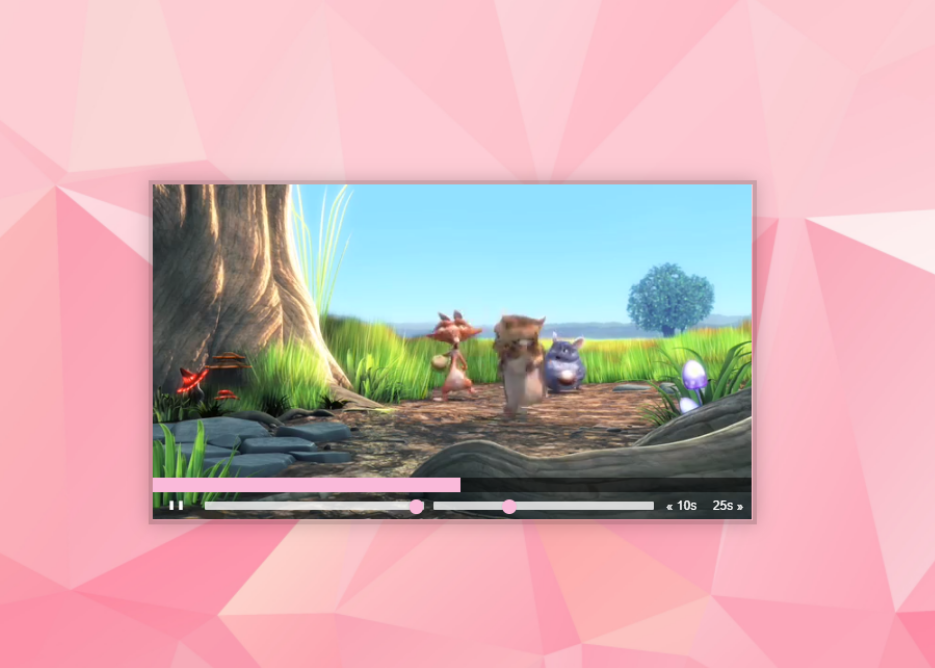

# [Wes Bos' 30 days Vanilla JS challenge](https://javascript30.com/)

## `No frameworks, no compilers, no fuss;`

### [Day 11: Custom HTML Video Player](https://2y2son4.github.io/simple-js-html-videoplayer/).

#### **HTML**

- [`<video>`](https://developer.mozilla.org/en-US/docs/Web/HTML/Element/video)

#### **JS**

- [parseFloat()](https://developer.mozilla.org/en-US/docs/Web/JavaScript/Reference/Global_Objects/parseFloat)
- [video.pause | video.play() | ... ](https://developer.mozilla.org/en-US/docs/Web/API/HTMLMediaElement)

Click here to check the <strong>layout</strong>.

